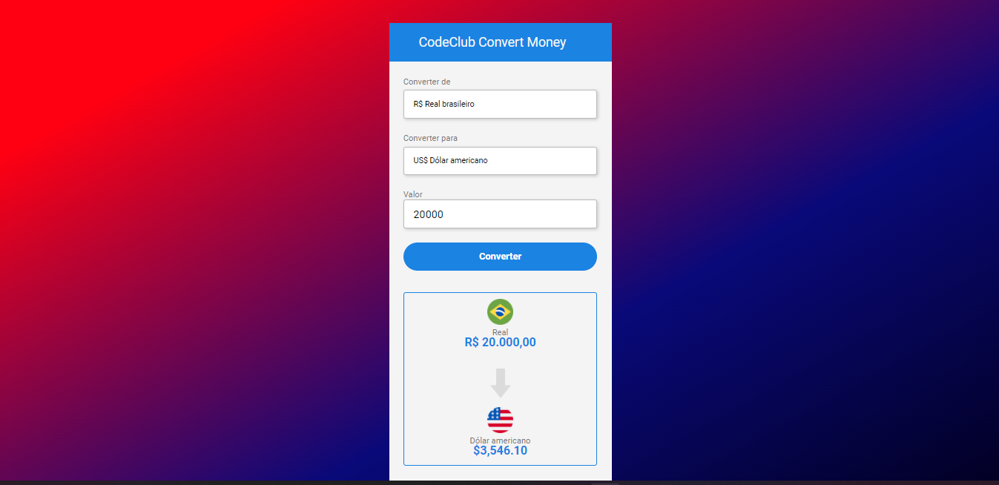

# currency_converter
 coverting coin 

 

 <a href="https://conversor-de-moedas-2v.netlify.app/">Link do site

</a>

> o projeto se trata de um site onde os usuários poderão converter valores em reais para 3 tipos de moedas , Dólar ,Euro e Bitcoin .

<table>
  <tr>
    <td align="center">
      <a href="#">
         
        
          <b>Kevin Mateus</b>
        
      </a>
    </td>
   
</table> 
